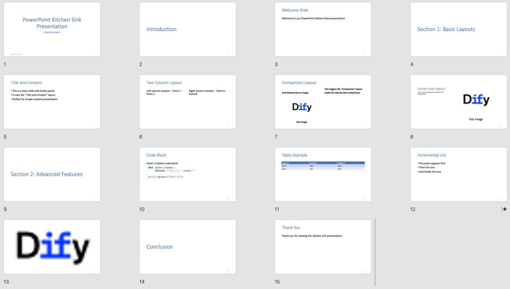
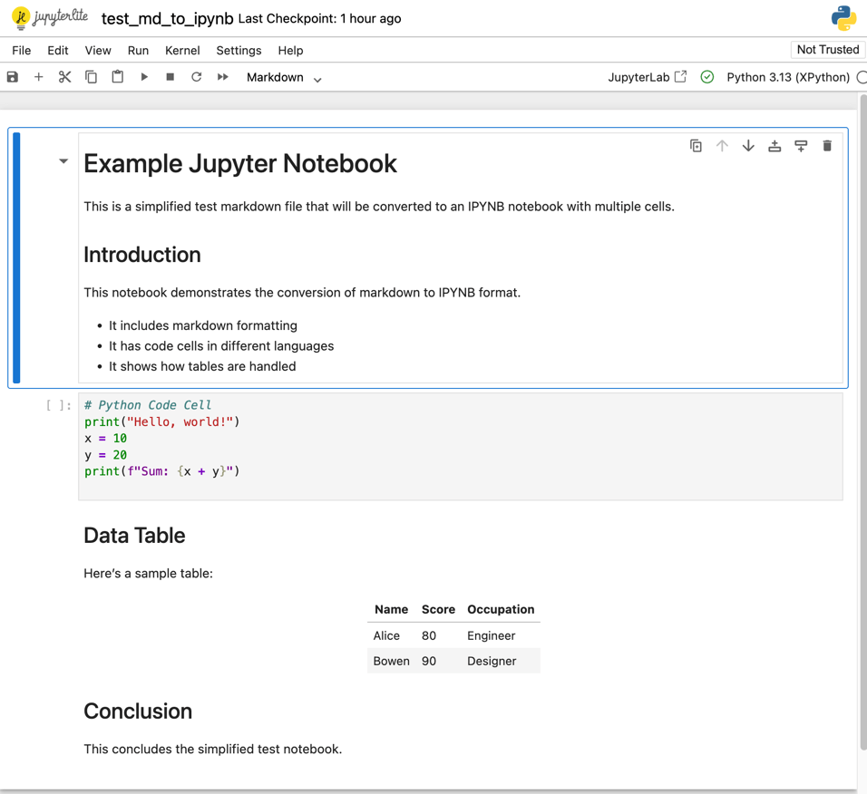

<div align="center">
  
</div>

# Markdown Exporter
### An Agent Skill and Dify plugin to Export Markdown Into Powerful Documents

- Author: [bowenliang123](https://github.com/bowenliang123)
- Github Repository: [](https://github.com/bowenliang123/md_exporter)

- Markdown Exporter can be used as:

| Use As                          | Installation                                                                                                                                                                                                                                                                                                                                                                                                                                                                                                                                                                                                                                                                                                                                                                                                              |
|---------------------------------|---------------------------------------------------------------------------------------------------------------------------------------------------------------------------------------------------------------------------------------------------------------------------------------------------------------------------------------------------------------------------------------------------------------------------------------------------------------------------------------------------------------------------------------------------------------------------------------------------------------------------------------------------------------------------------------------------------------------------------------------------------------------------------------------------------------------------|
| Dify Plugin                     | Platform: [Dify](https://github.com/langgenius/dify) <br/> - Install from the [Dify Marketplace](https://marketplace.dify.ai/plugins/bowenliang123/md_exporter).<br/> - Guide: Docs for [Installing Dify Plugins](https://docs.dify.ai/en/use-dify/workspace/plugins#installing-plugins).                                                                                                                                                                                                                                                                                                                                                                                                                                                                                                                                 |
| Agent Skills <br/> (standalone) | Platform: [SKILL.md](https://github.com/bowenliang123/md_exporter/blob/main/SKILL.md) is availiable for Any Agent Skills supported platform.<br/> - IDEs / CLIs ([Claude Code](https://code.claude.com/docs/en/skills), [Trae](https://docs.trae.ai/ide/skills), [Codebuddy](https://copilot.tencent.com/docs/cli/skills) etc.) <br/> - Agent Frameworks ( [LangChain DeepAgents](https://www.blog.langchain.com/using-skills-with-deep-agents/), [AgentScope](https://doc.agentscope.io/tutorial/task_agent_skill.html) etc.). <br/> <br/>- Local Import: <br/> Import [the source code zip file](https://github.com/bowenliang123/md_exporter/archive/refs/heads/main.zip).<br/><br/> - Remote install: <br/>Run `/plugin marketplace add bowenliang123/md_exporter` on CLIs, installing as a Clude Marketplace plugin. | 
| Python Package                  | Platform: Python <br/> - [md-exporter](https://pypi.org/project/md-exporter/)  on PyPI. Install by `pip install md-exporter`.                                                                                                                                                                                                                                                                                                                                                                                                                                                                                                                                                                                                                                                                                              |

---

## ✨ What is Markdown Exporter?

**Markdown Exporter** is a powerful toolset as an Agent Skill or a Dify plugin and  that transforms your Markdown text into a wide variety of professional formats. Whether you need to create polished reports, stunning presentations, organized spreadsheets, or code files—this tool has you covered.

With support for **15+ output formats**, Markdown Exporter bridges the gap between simple text editing and professional document creation, all while maintaining the simplicity and elegance of Markdown syntax.

### 🎯 Why You'll Love It

- **🚀 Lightning Fast** – Export your Markdown to multiple formats in milliseconds
- **🎨 Customizable** – Use custom templates for DOCX and PPTX to match your brand
- **🔒 100% Private** – All processing happens locally, no data ever leaves your environment
- **📊 Versatile** – From documents to spreadsheets, presentations to code files
- **🌐 Multi-Language Support** – Perfect for international teams and content

---

## 🛠️ Introduction and Use Guide

### Tools and Supported Formats

<table>
  <tr>
    <th>Tool</th>
    <th>Input</th>
    <th>Output</th>
  </tr>
  <tr>
    <td><code>md_to_docx</code></td>
    <td rowspan="7">📝 Markdown text</td>
    <td>📄 Word document (.docx)</td>
  </tr>
  <tr>
    <td><code>md_to_html</code></td>
    <td>🌐 HTML file (.html)</td>
  </tr>
  <tr>
    <td><code>md_to_html_text</code></td>
    <td>🌐 HTML text string</td>
  </tr>
  <tr>
    <td><code>md_to_pdf</code></td>
    <td>📑 PDF file (.pdf)</td>
  </tr>
  <tr>
    <td><code>md_to_png</code></td>
    <td>🖼️ PNG image(s) of PDF pages</td>
  </tr>
  <tr>
    <td><code>md_to_md</code></td>
    <td>📝 Markdown file (.md)</td>
  </tr>
  <tr>
    <td><code>md_to_ipynb</code></td>
    <td>📓 Jupyter Notebook (.ipynb)</td>
  </tr>
  <tr>
    <td><code>md_to_pptx</code></td>
    <td>
      <div>
        📝 Markdown slides
      </div>
      <div>
      in <a href="https://pandoc.org/MANUAL.html#slide-shows">Pandoc style </a>
      </div>
    </td>
    <td>🎯 PowerPoint (.pptx)</td>
  </tr>
  <tr>
    <td><code>md_to_xlsx</code></td>
    <td rowspan="5">📋<a href="https://www.markdownguide.org/extended-syntax/#tables"> Markdown tables </a> </td>
    <td>📊 Excel spreadsheet (.xlsx)</td>
  </tr>
  <tr>
    <td><code>md_to_csv</code></td>
    <td>📋 CSV file (.csv)</td>
  </tr>
  <tr>
    <td><code>md_to_json</code></td>
    <td>📦 JSON/JSONL file (.json)</td>
  </tr>
  <tr>
    <td><code>md_to_xml</code></td>
    <td>🏷️ XML file (.xml)</td>
  </tr>
  <tr>
    <td><code>md_to_latex</code></td>
    <td>📝 LaTeX file (.tex)</td>
  </tr>
  <tr>
    <td><code>md_to_codeblock</code></td>
    <td>💻 <a href="https://www.markdownguide.org/extended-syntax/#fenced-code-blocks"> Code blocks in Markdown </a> </td>
    <td>📁 Code files by language (.py, .js, .sh, etc.)</td>
  </tr>
  <tr>
    <td><code>md_to_linked_image</code></td>
    <td>🖼️ <a href="https://www.markdownguide.org/basic-syntax/#linking-images">Image links in Markdown</a> </td>
    <td>🖼️ Downloaded image files</td>
  </tr>
</table>

---

## 📖 Usage Example


Simply input your Markdown text, select your desired output format, and click export. It's that easy!

---

## 🎨 Tool Showcase

### 📄 Markdown → DOCX

Create professional Word documents with beautiful formatting.

> **✨ Pro Tip: Custom Styling with Templates**
>
> The `md_to_docx` tool supports custom DOCX template files, giving you full control over your document's appearance.
>
> **What you can customize:**
> - Heading styles (fonts, sizes, colors)
> - Paragraph formatting (spacing, indentation)
> - Table styles and borders
> - List styles and bullets
> - And much more!
>
> Check out the [default docx template](https://github.com/bowenliang123/md_exporter/blob/main/assets/template/docx_template.docx) or create your own. Learn how at [Customize or create new styles](https://support.microsoft.com/en-us/office/customize-or-create-new-styles-d38d6e47-f6fc-48eb-a607-1eb120dec563).


---

### 📊 Markdown → XLSX

Convert your Markdown tables into polished Excel spreadsheets with auto-fitted columns and preserved data types.

**Input:**
```markdown
| Name    | Age | City        |
|---------|-----|-------------|
| Alice   | 30  | New York    |
| Bowen   | 25  | Guangzhou   |
| Charlie | 35  | Tokyo       |
| David   | 40  | Miami       |
```

**Output:**


---

### 🎯 Markdown → PPTX

Turn your Markdown into stunning PowerPoint presentations automatically.

> **✨ Syntax Requirements**
>

>
> **Supported Features:**
> - ✅ Title slides
> - ✅ Column Layout
> - ✅ Tables
> - ✅ Hyperlinks
> - ✅ And more!
>
> > **🎨 Custom Templates:**
> >
> > Use custom PPTX templates with slide masters to match your brand's visual identity. [Learn how](https://support.microsoft.com/en-us/office/customize-a-slide-master-036d317b-3251-4237-8ddc-22f4668e2b56). Get the [default pptx template](https://github.com/bowenliang123/md_exporter/blob/main/assets/template/pptx_template.pptx).

The input Markdown must follows the syntax and guidance in [Pandoc Slide Shows](https://pandoc.org/MANUAL.html#slide-shows).

**Input Example:**

````markdown
---
title: Markdown Exporter
author: Bowen Liang
---

# Introduction

## Welcome Slide

Welcome to our Markdown Exporter!

::: notes
Remember to greet the audience warmly.
:::

---

# Section 1: Basic Layouts

## Title and Content

- This is a basic slide with bullet points
- It uses the "Title and Content" layout
- Perfect for simple content presentation

## Two Column Layout

::::: columns
::: column
Left column content:
- Point 1
- Point 2
:::
::: column
Right column content:
- Point A
- Point B
:::
:::::

## Comparison Layout

::::: columns
::: column
Text followed by an image:


:::
::: column
- This triggers the "Comparison" layout
- Useful for side-by-side comparisons
:::
:::::

## Content with Caption

Here's some explanatory text about the image below.


---

# Section 2: Advanced Features

## Code Block

Here's a Python code block:

```python
def greet(name):
    return f"Hello, {name}!"

print(greet("World"))
```

## Table Example

| Column 1 | Column 2 | Column 3 |
|----------|----------|----------|
| Row 1    | Data     | More     |
| Row 2    | Info     | Stuff    |

## Incremental List

::: incremental
- This point appears first
- Then this one
- And finally this one
  :::

## {background-image="https://avatars.githubusercontent.com/u/127165244?s=48&v=4"}

::: notes
This is a slide with a background image and speaker notes only.
The "Blank" layout will be used.
:::

# Conclusion

## Thank You

Thank you for viewing this kitchen sink presentation!

::: notes
Remember to thank the audience and invite questions.
:::
````

**Output:**


---

### 🌐 Markdown → HTML

Transform your Markdown into clean, semantic HTML perfect for web pages.


---

### 📑 Markdown → PDF

Generate professional PDF documents perfect for printing or sharing.


---

### 🖼️ Markdown → PNG

Convert your Markdown into beautiful PNG images. Great for:
- Social media posts
- Documentation screenshots
- Quick sharing in chat apps


---

### 🏷️ Markdown → Jupyter Notebook

Transform your Markdown into Jupyter Notebook `.ipynb` format.

**Input Example:**
````markdown
# Example Jupyter Notebook

This is a simplified test markdown file that will be converted to an IPYNB notebook with multiple cells.

## Introduction

This notebook demonstrates the conversion of markdown to IPYNB format.

- It includes markdown formatting
- It has code cells in different languages
- It shows how tables are handled

```python
# Python Code Cell
print("Hello, world!")
x = 10
y = 20
print(f"Sum: {x + y}")
```

## Data Table

Here's a sample table:

| Name  | Score | Occupation |
|-------|-------|------------|
| Alice | 80    | Engineer   |
| Bowen | 90    | Designer   |

## Conclusion

This concludes the simplified test notebook.
````

**Output File:**


---

### 💻 Markdown → Code Block Files

Effortlessly extract code blocks from your Markdown and save them as individual files, preserving syntax highlighting and formatting.

#### Supported Languages & File Extensions

| Language   | File Extension | Language   | File Extension |
|------------|----------------|------------|----------------|
| Python     | `.py`          | CSS        | `.css`         |
| JavaScript | `.js`          | YAML       | `.yaml`        |
| HTML       | `.html`        | Ruby       | `.rb`          |
| Bash       | `.sh`          | Java       | `.java`        |
| JSON       | `.json`        | PHP        | `.php`         |
| XML        | `.xml`         | Markdown   | `.md`          |
| SVG        | `.svg`         |            |                |


**Pro Tip:** Enable compression to bundle all extracted files into a single ZIP archive for easy sharing and organization!


---

### 🖼️ Markdown → Linked Images

Automatically download all images referenced in your Markdown.


---


### 📋 Markdown → CSV

Export your Markdown tables to universal CSV format.


---

### 📦 Markdown → JSON / JSONL

Convert your tables into structured data formats.

**JSONL Style (default)**
- One JSON object per line
- Perfect for streaming and logging


**JSON Array Style**
- All objects in a single array
- Ideal for API responses


---

### 🏷️ Markdown → XML

Transform your data into XML format.


---

### 📝 Markdown → LaTeX

Generate LaTeX source code for academic and technical documents.

**LaTeX Output:**


**Compiled PDF:**


---

### 📝 Markdown → Markdown

Save your Markdown content as a `.md` file for future use.


---

## 📢 Changelog
Releases are available at
- [Github Repo Releases](https://github.com/bowenliang123/md_exporter/releases).
- [Dify Marketplace Releases](https://marketplace.dify.ai/plugins/bowenliang123/md_exporter).

Changelog:

- 3.5.1
  - Correctly handle code cells by pre-processing markdown input in `md_to_ipynb` tool 

- 3.5.0:
  - Introduce `md_to_ipynb` tool for converting Markdown text to Jupyter Notebook (.ipynb) format
  - The `md_to_ipynb` tool automatically splits markdown content into separate notebook cells
  - Updated logo icon (for the very first time)

- 3.4.0:
  - [ BREAKING CHANGE ] migrated `md_to_pptx` tool to use `pandoc` for conversion for stable features and less dependency footprint.
  - The Markdown input for `md_to_pptx` tool now must follow the markdown syntax and guidance in [Pandoc slides](https://pandoc.org/MANUAL.html#slide-shows).

- 3.3.0:
  - Update `md_to_pptx` from 6.1.1 to 6.2.1
  - Remove `md_to_mermaid` tool for less installation timecost and footprint for downloading Nodejs runtime

- 3.2.0:
  - Introduce `md_to_mermaid` tool for converting Mermaid diagram code blocks in Markdown to PNG images
  - Refactor Agent Skill scripts and entry shell scripts
  
- 3.0.0:
  - `md_exporter` is now ready for Agent Skills and runnable in standalone
    - Add `SKILL.md` for Agent Skills description
    - Add `/scripts` for code scripts of all tools as Agent Skills exectuion entry
    - Extract the core file transformation logic into `/scripts/lib` sharing by both Agent Skills scripts and Dify Plugin
    - Add `pyproject.toml` as Python project description and dependency management
  - Add automated tests covering all usage of entry of Claude Skills scripts
  - bump `md2pptx` from 6.1 to 6.1.1 for bug fix in table caption 

- 2.3.0:
  - resolve xlsx generation by skipping irrelevant chars before first table in `md_to_xlsx` tool

- 2.2.0:
  - fix CI problems in GitHub Actions

- 2.1.0:
  - fix remote image fetching in `md_to_pptx` tool by updating `md2pptx` to 6.1

- 2.1.0:
  - fix missing table border in `md_to_docx` tool by updating default docx template file
  - intercept `run-python` marco usage in `md_to_pptx` tool

- 2.0.0:
  - [ BREAKING CHANGE ] migrate `md_to_docx` tool to use `pandoc` for conversion
  - Major improvements in `md_to_docx` tool
    - support custom styling by using a template DOCX file, setting the fonts, font size, color style for headings, paragraphs, etc.
    - optimized file size in generated docx file
    - better support for multi-language content
  - remove `md_to_rst` and `md_to_epub` tools
  - add `force_text_value` option in md_to_xlsx tool to control whether to force convert all cell values to text string

- 1.12.0:
  - fix input pptx template file optional in `md_to_pptx` tool
  - fix error message with file path in cmd assembly in `md_to_pptx` tool
  - bump `md2pptx` to 6.0

- 1.10.2:
  - bump `md2pptx` from 5.4.4 to 5.4.5
  - bump `python-docx` from 1.1 to 1.2.0
  - increase PDF generation capacity limit to 500MB

- 1.10.0:
  - Support output JSONL style in `md_to_json` tool, as JSON Lines format with one object per line
  - Change the default output style of `md_to_json` tool to JSONL
  - Minor doc updates in parameter description

- 1.9.0:
  - Support custom sheet name in `md_to_xlsx` tool by using headings in Markdown text
  - Force convert column type to string in `md_to_xlsx` tool to prevent data precision loss and display issues in Microsoft Excel
  - Autofit column width in `md_to_xlsx` tool

- 1.8.0:
  - Solve issues with garbled characters when opening CSV files containing non-ASCII characters (eg. Chinese or Japanese characters, Emoji characters etc.) in Microsoft Excel

- 1.7.0:
  - Support custom PPTX template file in `md_to_pptx` tool
  - Support file generation from multiple tables in md_to_csv, md_to_latex, md_to_xlsx tools

- 1.6.0:
  - Introducing `md_to_html_text` tool, support converting Markdown text to HTML text
  - Standardize fonts for headings and body paragraphs DOCX file generated by `md_to_docx` tool

- 1.5.0:
  - Improve PDF display for pure English markdown text input in `md_to_pdf` tool, by skipping the font setting for CJK characters
  - Introduce `md_to_epub` tool, support converting Markdown text to EPUB eBook files
  - Support compressing all png files in single zip file in `md_to_png` tool
  - Increase capacity limit for PDF file to 100MB in `md_to_pdf` tool
  - Remove explicit timeout config MAX_REQUEST_TIMEOUT

- 1.4.100:
  - Special version for celebrating [Dify](https://github.com/langgenius/dify)'s 100k GitHub stars milestone
  - add `md_to_png` tool, support converting Markdown text to PNG image files

- 1.3.0:
  - update SDK version

- 1.2.0:
  - Support compressing images to single zip file in `md_to_linked_image` tool

- 1.1.0:
  - Enable line breaks normalization in all tools by default, replacing all the occurrences of `\\n` to `\n`
  - Remove `<think>` tags of reasoning content in the input Markdown text
  - Fix missing custom output filename support in md_to_csv, md_to_json, md_to_latex tool

- 1.0.1:
  - Remove redundant URL safe conversion in custom output filename

- 1.0.0:
  - Support customize the output file name

- 0.5.0:
  - Introducing `md_to_linked_image` tool, support extracting image files in links in Markdown text

- 0.4.3:
  - improve the display of Chinese characters in text paragraph in `md_to_docx` tool, by setting global font to Song if content contains Chinese     - improve the display of Chinese characters in text paragraph in `md_to_docx` tool, by setting global font to Song if content contains Chinese charactor

- 0.4.2:
  - support Java, PHP and Ruby file exporting in `md_to_codeblocks` tool

- 0.4.1:
  - support YAML file exporting in `md_to_codeblocks` tool

- 0.4.0:
  - support exporting Markdown codeblocks in to single zip file in `md_to_codeblocks` tool

- 0.3.0:
  - Fixed the error in importing libraries of `md_to_pptx` tool when running on self-hosted Dify plugin-daemon service

- 0.2.0:
  - Introducing `md_to_codeblock` tool, support extracting code blocks in Markdown to Python, JSON, JS, BASH, SVG, HTML, XML, MARKDOWN files.
  - Introducing `md_to_rst` tool, support reStructuredText `.rst` file format as destination file format

- 0.1.x:
  - Introducing `md_to_pptx` tool, support PowerPoint `.pptx` file format as destination file format

- 0.0.x:
  - Published to Dify Marketplace
  - support exporting Markdown to DOCX, PPTX, XLSX, PDF, HTML, MD, CSV, JSON, XML, LaTex files

---


## 🤝 Contributing

Contributions are welcome! Please feel free to submit issues or pull requests on our [GitHub repository](https://github.com/bowenliang123/md_exporter).

### Code Style

We use `ruff` to ensure code consistency. Run the following command to automatically fix code style issues:

```bash
uv run ruff check --fix --select UP .
```

Or use the provided script:

```bash
uv run dev.reformat.sh
```

---

## 📜 License

This project is licensed under the **Apache License 2.0**.

---

## 🔒 Privacy

Privacy matters. See the [Privacy Policy](./PRIVACY.md) for more details. This plugin:
- Collects **NO** data
- Processes everything **locally**
- Sends **NO information** to third-party services

All file transformations happen entirely within the local environment.

---

## 🙏 Acknowledgments

This project stands on the shoulders of giants. We're grateful to these amazing open-source projects:

| Project                                               | License              |
|-------------------------------------------------------|----------------------|
| [pypandoc](https://github.com/JessicaTegner/pypandoc) | MIT License          |
| [pandas](https://github.com/pandas-dev/pandas)        | BSD 3-Clause License |
| [xhtml2pdf](https://github.com/xhtml2pdf/xhtml2pdf)   | Apache License 2.0   |
