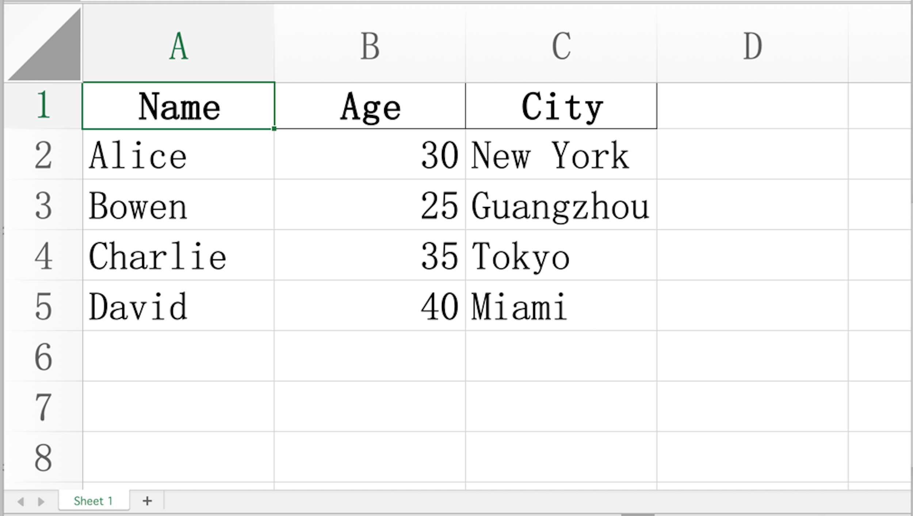
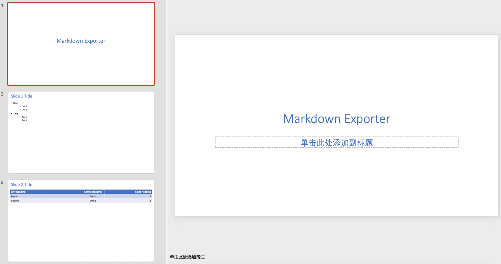

# Markdown Exporter
### Transform Your Markdowns Into Powerful Documents
### as Agent Skills and Dify Plugin 

- Author: [bowenliang123](https://github.com/bowenliang123)
- Github Repository: [](https://github.com/bowenliang123/md_exporter)
- This plugin can be used as:

| Usage                                                                                                 | Installation                                                                                                                                                                                                                      |
|-------------------------------------------------------------------------------------------------------|-----------------------------------------------------------------------------------------------------------------------------------------------------------------------------------------------------------------------------------|
| **[Dify Plugin](https://docs.dify.ai/en/develop-plugin/getting-started/getting-started-dify-plugin)** | Install to Dify platform from the [Dify Marketplace](https://marketplace.dify.ai/plugins/bowenliang123/md_exporter).                                                                                                              |
| **[Agent Skills](https://agentskills.io/home)** <br> (standalone)                                     | Use as standalone Agent Skills. <br> Import and use the [SKILL.md](https://github.com/bowenliang123/md_exporter/blob/main/SKILL.md) with [the repo zip](https://github.com/bowenliang123/md_exporter/archive/refs/heads/main.zip) |
| **[Claude Code](https://code.claude.com/docs/en/skills)** <br> (Agent Skills in Claude Plugin)        | Install to Claude Code as Claude Plugin. <br> Run `/plugin marketplace add bowenliang123/md_exporter` on Claude Code CLI.                                                                                                         |
| **Python Package**                                                                                    | As python package availiable on Pypi. `pip install md-exporter`                                                                                                                                                                   |

---

## ✨ What is Markdown Exporter?

**Markdown Exporter** is a powerful toolset as both Dify plugin and Claude Skill that transforms your Markdown text into a wide variety of professional formats. Whether you need to create polished reports, stunning presentations, organized spreadsheets, or code files—this tool has you covered.

With support for **15+ output formats**, Markdown Exporter bridges the gap between simple text editing and professional document creation, all while maintaining the simplicity and elegance of Markdown syntax.

### 🎯 Why You'll Love It

- **🚀 Lightning Fast** – Export your Markdown to multiple formats in milliseconds
- **🎨 Customizable** – Use custom templates for DOCX and PPTX to match your brand
- **🔒 100% Private** – All processing happens locally, no data ever leaves your environment
- **📊 Versatile** – From documents to spreadsheets, presentations to code files
- **🌐 Multi-Language Support** – Perfect for international teams and content

---

## 🛠️ Introduction and Use Guide

### Tools and Supported Formats

<table>
  <tr>
    <th>Tool</th>
    <th>Input</th>
    <th>Output</th>
  </tr>
  <tr>
    <td><code>md_to_docx</code></td>
    <td rowspan="6">📝 Markdown text</td>
    <td>📄 Word document (.docx)</td>
  </tr>
  <tr>
    <td><code>md_to_html</code></td>
    <td>🌐 HTML file (.html)</td>
  </tr>
  <tr>
    <td><code>md_to_html_text</code></td>
    <td>🌐 HTML text string</td>
  </tr>
  <tr>
    <td><code>md_to_pdf</code></td>
    <td>📑 PDF file (.pdf)</td>
  </tr>
  <tr>
    <td><code>md_to_png</code></td>
    <td>🖼️ PNG image(s) of PDF pages</td>
  </tr>
  <tr>
    <td><code>md_to_md</code></td>
    <td>📝 Markdown file (.md)</td>
  </tr>
  <tr>
    <td><code>md_to_pptx</code></td>
    <td>
      <div>
        📝 Markdown slides
      </div>
      <div>
      in <a href="https://github.com/MartinPacker/md2pptx/blob/master/docs/user-guide.md#creating-slides"> md2pptx </a> style
      </div>
    </td>
    <td>🎯 PowerPoint (.pptx)</td>
  </tr>
  <tr>
    <td><code>md_to_xlsx</code></td>
    <td rowspan="5">📋<a href="https://www.markdownguide.org/extended-syntax/#tables"> Markdown tables </a> </td>
    <td>📊 Excel spreadsheet (.xlsx)</td>
  </tr>
  <tr>
    <td><code>md_to_csv</code></td>
    <td>📋 CSV file (.csv)</td>
  </tr>
  <tr>
    <td><code>md_to_json</code></td>
    <td>📦 JSON/JSONL file (.json)</td>
  </tr>
  <tr>
    <td><code>md_to_xml</code></td>
    <td>🏷️ XML file (.xml)</td>
  </tr>
  <tr>
    <td><code>md_to_latex</code></td>
    <td>📝 LaTeX file (.tex)</td>
  </tr>
  <tr>
    <td><code>md_to_codeblock</code></td>
    <td>💻 <a href="https://www.markdownguide.org/extended-syntax/#fenced-code-blocks"> Code blocks in Markdown </a> </td>
    <td>📁 Code files by language (.py, .js, .sh, etc.)</td>
  </tr>
  <tr>
    <td><code>md_to_linked_image</code></td>
    <td>🖼️ <a href="https://www.markdownguide.org/basic-syntax/#linking-images">Image links in Markdown</a> </td>
    <td>🖼️ Downloaded image files</td>
  </tr>
  <tr>
    <td><code>md_to_mermaid</code></td>
    <td>📊 <a href="https://mermaid.js.org/">Mermaid diagrams in Markdown</a> </td>
    <td>🖼️ PNG image(s) of Mermaid diagrams</td>
  </tr>
</table>

---

## 📖 Usage Example


Simply input your Markdown text, select your desired output format, and click export. It's that easy!

---

## 🎨 Tool Showcase

### 📄 Markdown → DOCX

Create professional Word documents with beautiful formatting.

> **✨ Pro Tip: Custom Styling with Templates**
>
> The `md_to_docx` tool supports custom DOCX template files, giving you full control over your document's appearance.
>
> **What you can customize:**
> - Heading styles (fonts, sizes, colors)
> - Paragraph formatting (spacing, indentation)
> - Table styles and borders
> - List styles and bullets
> - And much more!
>
> Check out the [default docx template](https://github.com/bowenliang123/md_exporter/blob/main/assets/template/docx_template.docx) or create your own. Learn how at [Customize or create new styles](https://support.microsoft.com/en-us/office/customize-or-create-new-styles-d38d6e47-f6fc-48eb-a607-1eb120dec563).


---

### 📊 Markdown → XLSX

Convert your Markdown tables into polished Excel spreadsheets with auto-fitted columns and preserved data types.

**Input:**
```markdown
| Name    | Age | City        |
|---------|-----|-------------|
| Alice   | 30  | New York    |
| Bowen   | 25  | Guangzhou   |
| Charlie | 35  | Tokyo       |
| David   | 40  | Miami       |
```

**Output:**


---

### 🎯 Markdown → PPTX

Turn your Markdown into stunning PowerPoint presentations automatically.

> **✨ Syntax Requirements**
>
> Input slides must follow [md2pptx syntax](https://github.com/MartinPacker/md2pptx/blob/master/docs/user-guide.md#creating-slides).
>
> **Supported Features:**
> - ✅ Title slides
> - ✅ Bullet lists with nesting
> - ✅ Tables
> - ✅ Hyperlinks
> - ✅ And more!
>
> > **🎨 Custom Templates:**
> >
> > Use custom PPTX templates with slide masters to match your brand's visual identity. [Learn how](https://support.microsoft.com/en-us/office/customize-a-slide-master-036d317b-3251-4237-8ddc-22f4668e2b56). Get the [default pptx template](https://github.com/bowenliang123/md_exporter/blob/main/assets/template/pptx_template.pptx).

**Input Example:**
```markdown
# Markdown Exporter

### Slide 1 Title
* One
    * One A
    * One B
* Two
    * Two X
    * Two Y

### Slide 2 Title
|Left Heading|Centre Heading|Right Heading|
|:---|:-:|--:|
|Alpha|Bravo|1|
|Charlie|Delta|2|
```

**Output:**


---

### 🌐 Markdown → HTML

Transform your Markdown into clean, semantic HTML perfect for web pages.


---

### 📑 Markdown → PDF

Generate professional PDF documents perfect for printing or sharing.


---

### 🖼️ Markdown → PNG

Convert your Markdown into beautiful PNG images. Great for:
- Social media posts
- Documentation screenshots
- Quick sharing in chat apps


---

### 💻 Markdown → Code Block Files

Effortlessly extract code blocks from your Markdown and save them as individual files, preserving syntax highlighting and formatting.

#### Supported Languages & File Extensions

| Language   | File Extension | Language   | File Extension |
|------------|----------------|------------|----------------|
| Python     | `.py`          | CSS        | `.css`         |
| JavaScript | `.js`          | YAML       | `.yaml`        |
| HTML       | `.html`        | Ruby       | `.rb`          |
| Bash       | `.sh`          | Java       | `.java`        |
| JSON       | `.json`        | PHP        | `.php`         |
| XML        | `.xml`         | Markdown   | `.md`          |
| SVG        | `.svg`         |            |                |


**Pro Tip:** Enable compression to bundle all extracted files into a single ZIP archive for easy sharing and organization!


---

### 🖼️ Markdown → Linked Images

Automatically download all images referenced in your Markdown.


---

### � Markdown → Mermaid Diagrams

Convert Mermaid diagram code blocks in your Markdown to beautiful PNG images.


**Input Example:**
```markdown

```

**Output:**
PNG images of your Mermaid diagrams, ready to use in presentations, reports, or documentation.

---

### �📋 Markdown → CSV

Export your Markdown tables to universal CSV format.


---

### 📦 Markdown → JSON / JSONL

Convert your tables into structured data formats.

**JSONL Style (default)**
- One JSON object per line
- Perfect for streaming and logging


**JSON Array Style**
- All objects in a single array
- Ideal for API responses


---

### 🏷️ Markdown → XML

Transform your data into XML format.


---

### 📝 Markdown → LaTeX

Generate LaTeX source code for academic and technical documents.

**LaTeX Output:**


**Compiled PDF:**


---

### 📝 Markdown → Markdown

Save your Markdown content as a `.md` file for future use.


---

## 📢 Changelog
Releases are available at
- [Github Repo Releases](https://github.com/bowenliang123/md_exporter/releases).
- [Dify Marketplace Releases](https://marketplace.dify.ai/plugins/bowenliang123/md_exporter).

Release changelogs:
- 3.0.0:
  - `md_exporter` is now ready for Claude Agent Skills and runnable in standalone
    - Add `SKILL.md` for Claude Skills description
    - Add `/scripts` for code scripts of all tools as Claude Skills exectuion entry
    - Extract the core file transformation logic into `/scripts/lib` sharing by both Claude Skills scripts and Dify Plugin
    - Add `pyproject.toml` as Python project description and dependency management
  - Add automated tests covering all usage of entry of Claude Skills scripts
  - bump `md2pptx` from 6.1 to 6.1.1 for bug fix in table caption 

- 2.3.0:
  - resolve xlsx generation by skipping irrelevant chars before first table in `md_to_xlsx` tool

- 2.2.0:
  - fix CI problems in GitHub Actions

- 2.1.0:
  - fix remote image fetching in `md_to_pptx` tool by updating `md2pptx` to 6.1

- 2.1.0:
  - fix missing table border in `md_to_docx` tool by updating default docx template file
  - intercept `run-python` marco usage in `md_to_pptx` tool

- 2.0.0:
  - [ BREAKING CHANGE ] migrate `md_to_docx` tool to use `pandoc` for conversion
  - Major improvements in `md_to_docx` tool
    - support custom styling by using a template DOCX file, setting the fonts, font size, color style for headings, paragraphs, etc.
    - optimized file size in generated docx file
    - better support for multi-language content
  - remove `md_to_rst` and `md_to_epub` tools
  - add `force_text_value` option in md_to_xlsx tool to control whether to force convert all cell values to text string

- 1.12.0:
  - fix input pptx template file optional in `md_to_pptx` tool
  - fix error message with file path in cmd assembly in `md_to_pptx` tool
  - bump `md2pptx` to 6.0

- 1.10.2:
  - bump `md2pptx` from 5.4.4 to 5.4.5
  - bump `python-docx` from 1.1 to 1.2.0
  - increase PDF generation capacity limit to 500MB

- 1.10.0:
  - Support output JSONL style in `md_to_json` tool, as JSON Lines format with one object per line
  - Change the default output style of `md_to_json` tool to JSONL
  - Minor doc updates in parameter description

- 1.9.0:
  - Support custom sheet name in `md_to_xlsx` tool by using headings in Markdown text
  - Force convert column type to string in `md_to_xlsx` tool to prevent data precision loss and display issues in Microsoft Excel
  - Autofit column width in `md_to_xlsx` tool

- 1.8.0:
  - Solve issues with garbled characters when opening CSV files containing non-ASCII characters (eg. Chinese or Japanese characters, Emoji characters etc.) in Microsoft Excel

- 1.7.0:
  - Support custom PPTX template file in `md_to_pptx` tool
  - Support file generation from multiple tables in md_to_csv, md_to_latex, md_to_xlsx tools

- 1.6.0:
  - Introducing `md_to_html_text` tool, support converting Markdown text to HTML text
  - Standardize fonts for headings and body paragraphs DOCX file generated by `md_to_docx` tool

- 1.5.0:
  - Improve PDF display for pure English markdown text input in `md_to_pdf` tool, by skipping the font setting for CJK characters
  - Introduce `md_to_epub` tool, support converting Markdown text to EPUB eBook files
  - Support compressing all png files in single zip file in `md_to_png` tool
  - Increase capacity limit for PDF file to 100MB in `md_to_pdf` tool
  - Remove explicit timeout config MAX_REQUEST_TIMEOUT

- 1.4.100:
  - Special version for celebrating [Dify](https://github.com/langgenius/dify)'s 100k GitHub stars milestone
  - add `md_to_png` tool, support converting Markdown text to PNG image files

- 1.3.0:
  - update SDK version

- 1.2.0:
  - Support compressing images to single zip file in `md_to_linked_image` tool

- 1.1.0:
  - Enable line breaks normalization in all tools by default, replacing all the occurrences of `\\n` to `\n`
  - Remove `<think>` tags of reasoning content in the input Markdown text
  - Fix missing custom output filename support in md_to_csv, md_to_json, md_to_latex tool

- 1.0.1:
  - Remove redundant URL safe conversion in custom output filename

- 1.0.0:
  - Support customize the output file name

- 0.5.0:
  - Introducing `md_to_linked_image` tool, support extracting image files in links in Markdown text

- 0.4.3:
  - improve the display of Chinese characters in text paragraph in `md_to_docx` tool, by setting global font to Song if content contains Chinese     - improve the display of Chinese characters in text paragraph in `md_to_docx` tool, by setting global font to Song if content contains Chinese charactor

- 0.4.2:
  - support Java, PHP and Ruby file exporting in `md_to_codeblocks` tool

- 0.4.1:
  - support YAML file exporting in `md_to_codeblocks` tool

- 0.4.0:
  - support exporting Markdown codeblocks in to single zip file in `md_to_codeblocks` tool

- 0.3.0:
  - Fixed the error in importing libraries of `md_to_pptx` tool when running on self-hosted Dify plugin-daemon service

- 0.2.0:
  - Introducing `md_to_codeblock` tool, support extracting code blocks in Markdown to Python, JSON, JS, BASH, SVG, HTML, XML, MARKDOWN files.
  - Introducing `md_to_rst` tool, support reStructuredText `.rst` file format as destination file format

- 0.1.x:
  - Introducing `md_to_pptx` tool, support PowerPoint `.pptx` file format as destination file format

- 0.0.x:
  - Published to Dify Marketplace
  - support exporting Markdown to DOCX, PPTX, XLSX, PDF, HTML, MD, CSV, JSON, XML, LaTex files

---


## 🤝 Contributing

Contributions are welcome! Please feel free to submit issues or pull requests on our [GitHub repository](https://github.com/bowenliang123/md_exporter).

### Code Style

We use `ruff` to ensure code consistency. Run the following command to automatically fix code style issues:

```bash
uv run ruff check --fix --select UP .
```

Or use the provided script:

```bash
uv run dev.reformat.sh
```

---

## 📜 License

This project is licensed under the **Apache License 2.0**.

---

## 🔒 Privacy

Your privacy matters. This plugin:
- **Collects NO data**
- Processes everything **locally**
- Sends **NO information** to third-party services

All file transformations happen entirely within your environment.

---

## 🙏 Acknowledgments

This project stands on the shoulders of giants. We're grateful to these amazing open-source projects:

| Project | License |
|---------|---------|
| [md2pptx](https://github.com/MartinPacker/md2pptx) | MIT License |
| [pypandoc](https://github.com/JessicaTegner/pypandoc) | MIT License |
| [pandas](https://github.com/pandas-dev/pandas) | BSD 3-Clause License |
| [python-pptx](https://github.com/scanny/python-pptx) | MIT License |
| [xhtml2pdf](https://github.com/xhtml2pdf/xhtml2pdf) | Apache License 2.0 |
