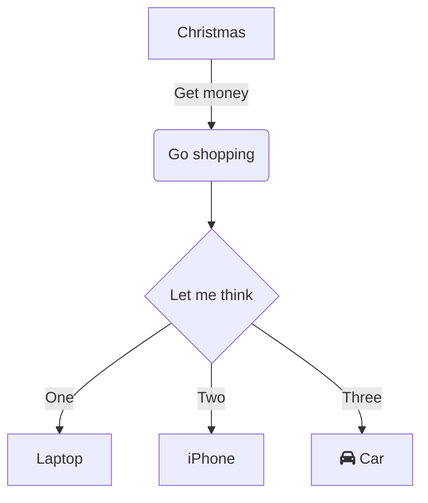

## This is a diagram1

```mermaid
graph TD;
    A-->B;
    A-->C;
    B-->D;
    C-->D;
```

## This is a diagram2

```mermaid
flowchart TD
    A[Christmas] -->|Get money| B(Go shopping)
    B --> C{Let me think}
    C -->|One| D[Laptop]
    C -->|Two| E[iPhone]
    C -->|Three| F[fa:fa-car Car]
```
